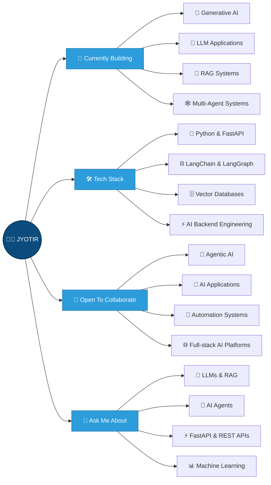

<div align="right">
  <a href="https://github-assistant-oycm.vercel.app/" target="_blank" rel="noopener noreferrer">
    
  </a>
</div>

<p align="center">

</p>

<p align="center">

</p>

<h1 align="center">Hey 👋, I'm Jyotir</h1>

<p align="center">
<a href="https://github.com/Jyotir2004">

</a>
</p>

<p align="center">
🚀 Passionate about <b>Generative AI, LLMs, RAG, AI Agents</b> and <b>Backend Development</b>.
</p>



<p align="center">
  <i>Building intelligent systems with Generative AI, LLMs, RAG, AI Agents and Python.</i>
</p>
```


    
<p align="center">
<a href="https://github.com/Jyotir2004"></a>
<a href="https://www.linkedin.com/in/jyotiraditya-khatua-2262b02a2"></a>
<a href="https://my-portfolio-gs6v.vercel.app/"></a>
<a href="mailto:jyotiraditya20122004@gmail.com">
</a>

</p>

<p align="center">


</p>

---

<h3 align="center">🧭 Quick Navigation</h3>

<p align="center">
<a href="#-github-stats">📊 Stats</a> ·
<a href="#-about-me">👋 About</a> ·
<a href="#️-tech-stack">🛠️ Tech Stack</a> ·
<a href="#-featured-projects">🚀 Projects</a> ·
<a href="#-deep-dive-technical-labs">🎓 Deep-Dive Labs</a> ·
<a href="#️-security--responsible-ai">🛡️ Security & Responsible AI</a> ·
<a href="#-learning-resources--inspiration">📖 Learning Library</a> ·
<a href="#️-2026-roadmap">🗺️ Roadmap</a> ·
<a href="#-unique-approach">🎨 Approach</a> ·
<a href="#-experience">💼 Experience</a> ·
<a href="#-connect-with-me">📫 Connect</a>
</p>

---

### 📊 GitHub Stats

<table>
  <tr>
    <td valign="top" width="55%">
      
      <br/><br/>
      
      <br/><br/>
      
    </td>
    <td align="center" valign="middle" width="45%">
      <a href="https://github-assistant-oycm.vercel.app/" target="_blank">
        
      </a>
    </td>
  </tr>
</table>

---

<h3 align="left">📈 Activity Graph</h3>

<p align="center">
  
</p>


## 👋 About Me

```python
class Jyotir:
role = "AI/ML Engineer Trainee · Generative AI Engineer · Python Backend Developer"
company = "Mobcoder"
location = "🌍 India · Open to Remote"

focus = [
"🤖 Generative AI, LLMs and prompt/context engineering",
"📚 Retrieval-Augmented Generation over real business documents",
"🕸️ Multi-agent systems with LangChain, LangGraph and MCP",
"⚡ Production Python backends with FastAPI",
"📊 Turning raw data into dashboards people actually use",
]

stack = {
"languages": ["Python", "SQL"],
"ai_ml": ["Machine Learning", "Deep Learning", "Generative AI",
"LLMs", "NLP", "RAG", "AI Agents"],
"backend": ["FastAPI", "LangChain", "LangGraph", "MCP"],
"databases": ["MySQL", "MongoDB", "Vector Databases"],
"tools": ["Git", "GitHub", "VS Code", "Jupyter", "Power BI", "Excel"],
}

learning = ["Agentic architectures", "Vector search at scale", "LLM evaluation"]
principle = "Ship it · Measure it · Make it reliable"
```

- 🔭 Currently working as an **AI/ML Engineer Trainee at Mobcoder**
- 🤖 Interested in **Generative AI, LLMs, RAG** and **AI Agents**
- 🐍 Building backend applications using **Python & FastAPI**
- 🧠 Exploring **LangChain, LangGraph, MCP** and **Vector Databases**
- 💻 Interested in **AI Engineering, SDE** and **LLM Engineering**
- 📫 Connect with me through the links below

---

<h3 align="center">⚙️ Everything I Build With</h3>

<p align="center">


  
  
  
  
  
  
  
  
  
  
  
  
  
  
  
  
  
  
  
  
  
  
  
  
  
  
  
  
  
  
  
  
  
  
  
  
  
  
  
  
  
  
  
  
  
  
  
  
  
  
  
  
  
</p>


### 🛠️ Tech Stack And Skills

<h3 align="center">💻 Programming Languages:</h3>
<p align="center">
  
  
  
  
  

</p>

<h3 align="center">🌐 Frontend Development:</h3>
<p align="center">
  
  <!-- <p align="center"> -->
  
    
</p>


<h3 align="center">⚙️ Backend Development:</h3>
<p align="center">
  
  
  <!-- <p align="center"> -->
 


<h3 align="center">🤖 AI & Machine Learning:</h3>
<p align="center">
  <!-- TensorFlow, Scikit-Learn, PyTorch, Anaconda -->
  

  <!-- NumPy -->
  

  <!-- Pandas -->
  

  <!-- LangGraph -->
  

  <!-- Jupyter -->
  

  <!-- Keras -->
  

  <!-- LangChain -->
  

  <!-- Hugging Face -->
  

  <!-- OpenCV -->
  

  <!-- Matplotlib -->
  
</p>

<h3 align="center">🗄️ Databases:</h3>
<p align="center">
  
  
</p>


<h3 align="center">🔧 Tools & Technologies:</h3>
<p align="center">
  

  <!-- <p align="center"> -->
  <!-- Git, VS Code, Visual Studio -->
  

  <!-- n8n -->
  

  <!-- Streamlit -->
  

  <!-- Canva -->
  

  <!-- Figma, Postman, Linux -->
  
</p>


<h4 align="center">Languages</h4>
<p align="center">


</p>

<h4 align="center">AI / ML & Generative AI</h4>
<p align="center">


</p>

<h4 align="center">Frameworks & Backend</h4>
<p align="center">


</p>

<h4 align="center">Databases & Vector Stores</h4>
<p align="center">


</p>

<h4 align="center">Tools & DevOps</h4>
<p align="center">


</p>

---

## 🚀 Featured Projects

| Project | Description | Tech | Repo |
| :--- | :--- | :--- | :---: |
| 🤖 **AI Travel Agent** | Multi-agent AI travel assistant that plans, prices and coordinates trips end to end. | `Python` `FastAPI` `LangChain` `MCP` `MongoDB` `LLMs` | [Repo](https://github.com/Jyotir2004/travel_agent_2.0) |
| 🏥 **MedSync – AI Clinic Assistant** | AI clinic assistant handling appointment booking, cancellation, slot management, patient interaction and voice transcription. | `Python` `FastAPI` `LLMs` `Speech-to-Text` | [Repo](https://github.com/Jyotir2004/Medic-AI) |
| 📚 **RAG Chatbot** | Document question-answering over uploaded PDFs with semantic retrieval and cited answers. | `FastAPI` `LangChain` `ChromaDB` `OpenAI Embeddings` | [Repo](https://github.com/Jyotir2004/RAG-Chatbot) |
| 🔎 **AI Research Agent** | Autonomous research agent that gathers, filters and summarises sources into a usable brief. | `Python` `LangChain` `LLMs` `Agents` | [Repo](https://github.com/Jyotir2004/AI-Research-Agent) |
| 🛒 **CommerceNetAI** | AI-assisted e-commerce intelligence — product data, scraping and insight generation. | `Python` `FastAPI` `LLMs` | [Repo](https://github.com/Jyotir2004/CommerceNetAI) |
| 📊 **HR Analytics Dashboard** | Attrition and workforce analytics across 1,470 employees with drill-down visuals. | `Power BI` `Data Analysis` | [Repo](https://github.com/Jyotir2004/hr-analytics-dashboard) |
| 🏏 **IPL Cricket Dashboard** | Interactive cricket analytics dashboard with season, team and player breakdowns. | `Python` `Streamlit` `Pandas` `Visualization` | [Repo](YOUR_IPL_REPO_URL) |

---

## 🎓 Deep-Dive Technical Labs

Hands-on experiments I keep running to understand *why* things work, not just that they do.

| Lab | What I explore |
| :--- | :--- |
| 🧩 **RAG Lab** | Chunking strategies, hybrid search, re-ranking and how each choice moves answer quality |
| 🕸️ **Agent Lab** | LangGraph state machines, tool-calling loops, retries and guardrails against runaway agents |
| 🔌 **MCP Lab** | Building Model Context Protocol servers so models can reach real tools and data safely |
| 📐 **Prompt & Eval Lab** | Prompt patterns, structured outputs with Pydantic, and evaluating LLM output objectively |
| ⚙️ **FastAPI Lab** | Async patterns, background jobs, streaming responses and clean service layering |

---

## 🛡️ Security & Responsible AI

- 🔐 Secrets, API keys and model credentials kept out of code — environment-driven config only
- 🧪 Prompt-injection awareness when agents touch user documents, tools or external URLs
- 🚧 Input validation and output guardrails on every LLM-facing endpoint
- 🧾 Grounded, citation-backed answers in RAG systems instead of confident hallucinations
- 🙈 PII-aware handling of patient and customer data in healthcare-style applications

---

## 📖 Learning Resources & Inspiration

| Resource | Why it's on my list |
| :--- | :--- |
| 📘 **LangChain & LangGraph docs** | The fastest way to understand agent orchestration primitives |
| 📗 **FastAPI docs** | Still the cleanest example of great Python API design |
| 📕 **Hands-On Machine Learning (Géron)** | Solid foundations before reaching for big models |
| 📙 **Deep Learning Specialization** | Intuition behind the architectures powering modern LLMs |
| 📰 **Papers: Attention Is All You Need, RAG, ReAct** | The ideas everything else is built on |
| 🎧 **Anthropic / OpenAI engineering blogs** | How agentic systems behave outside of demos |

---

## 🗺️ 2026 Roadmap

- [ ] 🚀 Ship a production-grade multi-agent system with full observability
- [ ] 🧠 Go deeper on LLM fine-tuning, LoRA and model evaluation
- [ ] 🔍 Master vector search at scale (hybrid retrieval, re-ranking, caching)
- [ ] 🐳 Strengthen DevOps: Docker, CI/CD and cloud deployment for AI services
- [ ] 📦 Open-source a reusable RAG + agent starter template
- [ ] ✍️ Write about everything I learn along the way

---

## 🎨 Unique Approach

> **Build small · Measure honestly · Then scale**

- 🎯 **Problem first, model second** — the simplest thing that solves it wins
- 🔬 **Evaluate everything** — an LLM feature without evaluation is a guess
- 🧱 **Backend discipline for AI** — typed schemas, clean layers, real error handling
- 🔁 **Iterate in public** — every project ships with a README explaining the trade-offs
- 🤝 **Explainable by default** — if I can't explain the pipeline, it isn't done

---


## 💼 Experience

### 🧠 AI/ML Engineer Trainee — *Mobcoder*
Working on AI/ML and Generative AI applications involving:

`Python` · `FastAPI` · `LLMs` · `RAG` · `AI Agents` · `MCP` · `LangChain` · `LangGraph`

### 📊 Data Analytics & Visualization Intern — *Tanvika Software*
Worked on data analysis and visualisation using **Python** and **Excel**.

---
### PROFILE REVIEW

<p align="center">
  
</p>


## 🟡 Pac-Man Contribution Activity

<p align="center">
  
</p>


## 📫 Connect With Me

<p align="center">
<a href="https://www.linkedin.com/in/jyotiraditya-khatua-2262b02a2" target="_blank">

</a>
<a href="mailto:jyotiraditya20122004@gmail.com">

</a>
<a href="https://my-portfolio-gs6v.vercel.app/" target="_blank">

</a>
<a href="https://github.com/Jyotir2004" target="_blank">

</a>
</p>

<p align="center">
<a href="https://www.linkedin.com/in/jyotiraditya-khatua-2262b02a2"></a>
<a href="mailto:jyotiraditya20122004@gmail.com"></a>
<a href="https://my-portfolio-gs6v.vercel.app/"></a>
</p>

---

<p align="center">⭐ Thanks for visiting my profile!</p>
