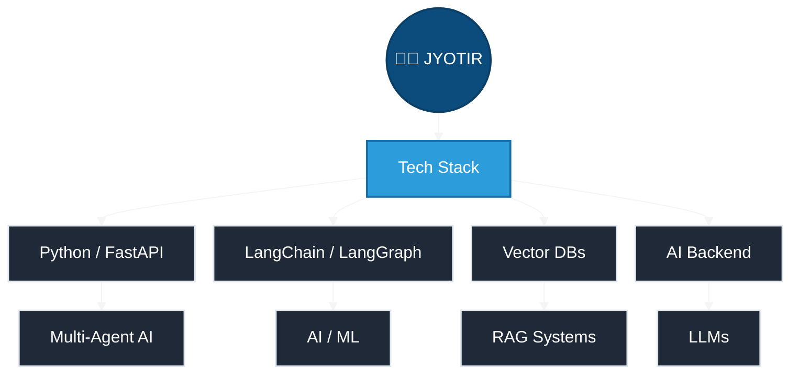

```mermaid
%%{init: {"theme":"base","themeVariables":{"primaryColor":"#1E90FF","primaryTextColor":"#ffffff","primaryBorderColor":"#0B4C7C","lineColor":"#F5F5F5","secondaryColor":"#0B4C7C","tertiaryColor":"#0D1117"},"flowchart":{"curve":"basis","nodeSpacing":18,"rankSpacing":28}}}%%
flowchart TB
    A(("🧑‍💻 JYOTIR"))
    B["Tech Stack"]
    C["Python / FastAPI"]
    D["LangChain / LangGraph"]
    E["Vector DBs"]
    F["AI Backend"]
    G["Multi-Agent AI"]
    H["AI / ML"]
    I["RAG Systems"]
    J["LLMs"]

    A --> B
    B --> C
    B --> D
    B --> E
    B --> F
    C --> G
    D --> H
    E --> I
    F --> J

    classDef core fill:#0B4C7C,stroke:#0b3f66,color:#fff,stroke-width:2px;
    classDef stack fill:#2D9CDB,stroke:#1B6FA8,color:#fff,stroke-width:2px;
    classDef item fill:#1F2937,stroke:#dfe7ec,color:#fff,stroke-width:1.5px;

    class A core;
    class B stack;
    class C,D,E,F,G,H,I,J item;
```

