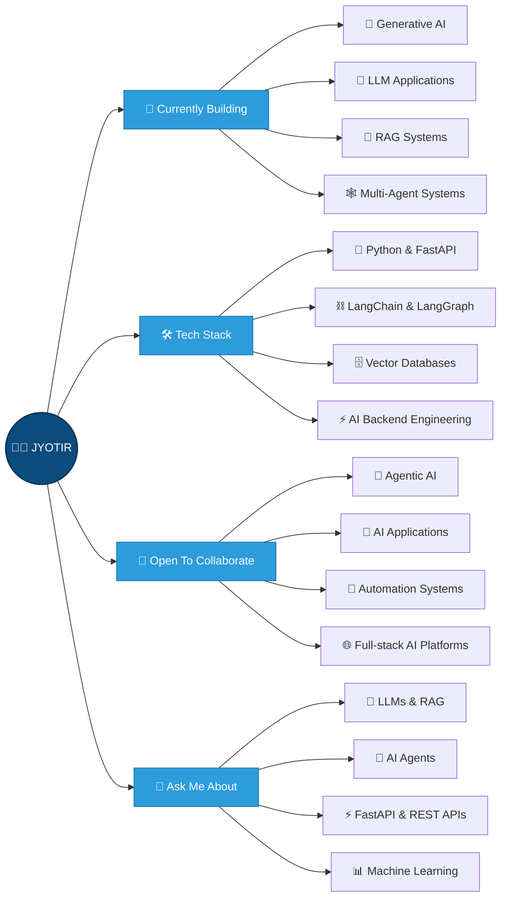

  

<!-- 

 -->

<h1 align="center">
  Hey , I'm Jyotir
</h1>

  

 🚀 Passionate about <b>Generative AI, LLMs, RAG, AI Agents</b> and <b>Backend Development</b>.

```mermaid
%%{init: {"flowchart": {"nodeSpacing": 25, "rankSpacing": 55}}}%%
flowchart LR
    ME(("🧑‍💻 JYOTIR"))

    ME --> CW["🚀 Currently Building"]
    CW --> CW1[🤖 Generative AI]
    CW --> CW2[🧠 LLM Applications]
    CW --> CW3[🔗 RAG Systems]
    CW --> CW4[🕸️ Multi-Agent Systems]

    ME --> EX["🛠️ Tech Stack"]
    EX --> EX1[🐍 Python & FastAPI]
    EX --> EX2[⛓️ LangChain & LangGraph]
    EX --> EX3[🗄️ Vector Databases]
    EX --> EX4[⚡ AI Backend Engineering]

    ME --> COL["🤝 Open To Collaborate"]
    COL --> COL1[🤖 Agentic AI]
    COL --> COL2[🚀 AI Applications]
    COL --> COL3[🔧 Automation Systems]
    COL --> COL4[🌐 Full-stack AI Platforms]

    ME --> ASK["💬 Ask Me About"]
    ASK --> ASK1[🧠 LLMs & RAG]
    ASK --> ASK2[🤖 AI Agents]
    ASK --> ASK3[⚡ FastAPI & REST APIs]
    ASK --> ASK4[📊 Machine Learning]

    style ME fill:#0B4C7C,stroke:#083656,stroke-width:2px,color:#fff
    style CW fill:#2D9CDB,stroke:#1B6FA8,color:#fff
    style EX fill:#2D9CDB,stroke:#1B6FA8,color:#fff
    style COL fill:#2D9CDB,stroke:#1B6FA8,color:#fff
    style ASK fill:#2D9CDB,stroke:#1B6FA8,color:#fff
```

  <i>Building intelligent systems with Generative AI, LLMs, RAG, AI Agents and Python.</i>

    

  

---

<h3 align="center">🧭 Quick Navigation</h3>

<a href="#-github-stats">📊 Stats</a> ·
<a href="#-about-me">👋 About</a> ·
<a href="#️-tech-stack">🛠️ Tech Stack</a> ·
<a href="#-featured-projects">🚀 Projects</a> ·
<a href="#-deep-dive-technical-labs">🎓 Deep-Dive Labs</a> ·
<a href="#️-security--responsible-ai">🛡️ Security & Responsible AI</a> ·
<a href="#-learning-resources--inspiration">📖 Learning Library</a> ·
<a href="#️-2026-roadmap">🗺️ Roadmap</a> ·
<a href="#-unique-approach">🎨 Approach</a> ·
<a href="#-resume">📄 Resume</a> ·
<a href="#-experience">💼 Experience</a> ·
<a href="#-connect-with-me">📫 Connect</a>

---

### 📊 GitHub Stats

<table>
  <tr>
    <td valign="top" width="55%">
      
        
      
        
      
    </td>
    <td align="center" valign="middle" width="45%">
      
    </td>
  </tr>
</table>

---

<h3 align="left">📊 Pacman Contribution Graph:</h3>

  

